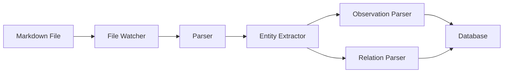

Basic Memory is a local-first knowledge management system with three main entrypoints: API, MCP, and CLI. Each uses a composition root pattern for clean dependency management.

## System Overview

Basic Memory consists of four main components:

<CardGroup cols={2}>
  <Card title="Markdown Files" icon="file-lines">
    Source of truth stored on your filesystem
  </Card>
  <Card title="SQLite/Postgres Database" icon="database">
    Indexed knowledge graph for fast queries
  </Card>
  <Card title="MCP Server" icon="plug">
    LLM integration via Model Context Protocol
  </Card>
  <Card title="Sync Engine" icon="arrows-rotate">
    Bidirectional file-database synchronization
  </Card>
</CardGroup>

## Entrypoints

Basic Memory has three entrypoints, each with its own composition root:

### API Server (FastAPI)

REST API for HTTP access to the knowledge graph.

```python
# src/basic_memory/api/container.py
@dataclass
class ApiContainer:
    config: BasicMemoryConfig
    mode: RuntimeMode

    @classmethod
    def create(cls) -> "ApiContainer":
        config = ConfigManager().config
        mode = resolve_runtime_mode(is_test_env=config.is_test_env)
        return cls(config=config, mode=mode)
```

### MCP Server (FastMCP)

Model Context Protocol server for AI assistants like Claude.

```python
# src/basic_memory/mcp/container.py
@dataclass
class McpContainer:
    config: BasicMemoryConfig
    mode: RuntimeMode

    @classmethod
    def create(cls) -> "McpContainer":
        config = ConfigManager().config
        mode = resolve_runtime_mode(is_test_env=config.is_test_env)
        return cls(config=config, mode=mode)
```

### CLI (Typer)

Command-line interface for direct user interaction.

```python
# src/basic_memory/cli/container.py
@dataclass
class CliContainer:
    config: BasicMemoryConfig
    mode: RuntimeMode

    @classmethod
    def create(cls) -> "CliContainer":
        config = ConfigManager().config
        mode = resolve_runtime_mode()
        return cls(config=config, mode=mode)
```

## Composition Root Pattern

<Info>
**Key Principle**: Only composition roots read global configuration. All other modules receive configuration explicitly.
</Info>

Each entrypoint follows the composition root pattern:

<Steps>
  <Step title="Read Configuration">
    Container reads `ConfigManager` - the single source of global config
  </Step>
  <Step title="Resolve Runtime Mode">
    Determines if running in TEST, LOCAL, or CLOUD mode
  </Step>
  <Step title="Create Dependencies">
    Instantiates services and repositories with explicit config
  </Step>
  <Step title="Inject Dependencies">
    Provides dependencies to downstream code explicitly
  </Step>
</Steps>

## Runtime Mode Resolution

The `RuntimeMode` enum centralizes mode detection:

```python
class RuntimeMode(Enum):
    LOCAL = "local"
    CLOUD = "cloud"
    TEST = "test"

    @property
    def is_cloud(self) -> bool:
        return self == RuntimeMode.CLOUD

    @property
    def is_local(self) -> bool:
        return self == RuntimeMode.LOCAL

    @property
    def is_test(self) -> bool:
        return self == RuntimeMode.TEST
```

**Resolution precedence**: TEST > CLOUD > LOCAL

## Directory Structure

```
src/basic_memory/
├── alembic/           # Database migrations
├── api/               # FastAPI REST endpoints + container
├── cli/               # Typer CLI + container
├── deps/              # Feature-scoped FastAPI dependencies
├── importers/         # Import from Claude, ChatGPT, etc.
├── markdown/          # Markdown parsing and processing
├── mcp/               # MCP server + container + typed clients
├── models/            # SQLAlchemy ORM models
├── repository/        # Data access layer
├── schemas/           # Pydantic models for validation
├── services/          # Business logic layer
├── sync/              # File synchronization + coordinator
├── config.py          # Configuration management
├── db.py              # Database setup and migrations
└── runtime.py         # RuntimeMode enum and resolver
```

## Data Flow

### File to Knowledge Graph



<Steps>
  <Step title="File Detection">
    Sync engine detects file changes via checksums and mtime
  </Step>
  <Step title="Parsing">
    Markdown parser extracts frontmatter, observations, and relations
  </Step>
  <Step title="Entity Creation">
    Creates or updates Entity in database with external UUID
  </Step>
  <Step title="Observation Extraction">
    Parses `[category] content` patterns into Observation records
  </Step>
  <Step title="Relation Building">
    Resolves wiki links to create Relation records
  </Step>
</Steps>

### MCP Tool Flow

```
Claude Desktop → MCP Tool → Typed Client → HTTP API → Router → Service → Repository → Database
```

MCP tools use typed clients in `mcp/clients/` to communicate with the API:

- `KnowledgeClient` - Entity CRUD operations
- `SearchClient` - Search operations
- `MemoryClient` - Context building
- `DirectoryClient` - Directory listing
- `ResourceClient` - Resource reading
- `ProjectClient` - Project management

## Bidirectional Sync

The sync coordinator manages the lifecycle of file synchronization:

```python
# src/basic_memory/sync/coordinator.py
class SyncCoordinator:
    async def start(self) -> None:
        """Start watchers for all projects."""
        for project in projects:
            await self._start_watcher(project)

    async def stop(self) -> None:
        """Stop all watchers gracefully."""
        for watcher in self.watchers:
            await watcher.stop()
```

**Sync strategies**:

<Tabs>
  <Tab title="Manual Sync">
    ```bash
    bm sync
    ```
    One-time scan and update of all files
  </Tab>
  <Tab title="Watch Mode">
    ```bash
    bm sync --watch
    ```
    Continuous file system monitoring with real-time updates
  </Tab>
  <Tab title="Background Sync">
    MCP server automatically starts watchers on startup
  </Tab>
</Tabs>

## Change Detection

Sync uses multiple signals to detect changes:

- **SHA-256 checksum**: Content hash for detecting modifications
- **mtime**: Last modified timestamp
- **File size**: Quick preliminary check
- **Database timestamp**: Last sync time

## Repository Pattern

Data access uses the repository pattern for clean separation:

```python
# Example repository
class EntityRepository:
    async def get_by_id(self, entity_id: UUID) -> Entity | None:
        """Retrieve entity by UUID."""

    async def create(self, entity: EntityCreate) -> Entity:
        """Create new entity."""

    async def update(self, entity_id: UUID, updates: EntityUpdate) -> Entity:
        """Update existing entity."""

    async def delete(self, entity_id: UUID) -> None:
        """Delete entity."""
```

**Benefits**:

- Database logic isolated from business logic
- Easy to test with mocked repositories
- Database backend can be swapped (SQLite ↔ Postgres)

## Async Architecture

Basic Memory uses async/await throughout:

```python
# Async service example
class KnowledgeService:
    async def create_note(
        self,
        title: str,
        content: str,
        project: Project,
    ) -> Entity:
        # Async database operations
        entity = await self.entity_repo.create(...)
        # Async file operations
        await self.write_file(entity)
        return entity
```

**Key patterns**:

- SQLAlchemy 2.0 async ORM
- `aiofiles` for async file I/O
- `asyncpg` for PostgreSQL async driver
- `aiosqlite` for SQLite async adapter

## Testing Architecture

Tests use isolated environments:

<Accordion title="Unit Tests (tests/)">
  - Fast execution with mocking
  - Test individual functions and classes
  - Run with: `just test-unit-sqlite`
</Accordion>

<Accordion title="Integration Tests (test-int/)">
  - Real database and file operations
  - Full workflow testing
  - Run with: `just test-int-sqlite`
</Accordion>

<Accordion title="Dual Backend Testing">
  - All tests run against both SQLite and PostgreSQL
  - PostgreSQL uses testcontainers (Docker required)
  - Run with: `just test` or `just test-postgres`
</Accordion>

## Configuration Management

Configuration is centralized in `ConfigManager`:

```python
class BasicMemoryConfig(BaseSettings):
    # Paths
    base_dir: Path
    database_url: str
    
    # Features
    semantic_search_enabled: bool = False
    background_sync: bool = True
    
    # Database
    database_backend: DatabaseBackend = DatabaseBackend.SQLITE
    
    # Projects
    projects: dict[str, ProjectEntry]
    default_project: str
```

Configuration sources (priority order):

1. Environment variables (`BASIC_MEMORY_*`)
2. Config file (`~/.config/basic-memory/config.yaml`)
3. Default values

## Per-Project Cloud Routing

Projects can route independently to local or cloud:

```python
class ProjectEntry:
    path: Path
    mode: ProjectMode  # LOCAL or CLOUD

# MCP tools automatically route based on project mode
async with get_project_client(project_name) as (client, project):
    # client routes to LOCAL ASGI or CLOUD HTTP based on project.mode
    response = await call_get(client, "/entities")
```

## Security

<Warning>
Basic Memory stores OAuth tokens and API keys locally in `~/.local/share/basic-memory/`
</Warning>

**Security measures**:

- JWT authentication for cloud API
- API keys with Bearer token scheme
- No .env file loading (explicit config only)
- File permissions on token storage
- HTTPS required for cloud endpoints

## Next Steps

<CardGroup cols={2}>
  <Card title="Database Backends" icon="database" href="/advanced/database-backends">
    Learn about SQLite vs PostgreSQL
  </Card>
  <Card title="Development Guide" icon="code" href="/advanced/development">
    Set up your development environment
  </Card>
</CardGroup>