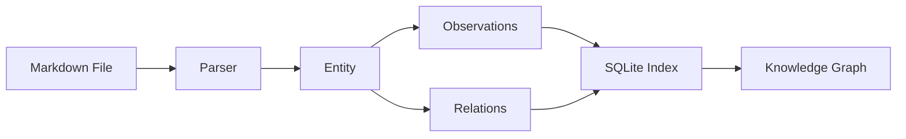

Basic Memory transforms plain Markdown files into a queryable knowledge graph that both humans and AI assistants can read and write to. This page explains the core architecture and how the system processes your notes.

## Architecture Overview

Basic Memory consists of four main components working together:

<Steps>
  <Step title="Markdown Files">
    Your knowledge lives in plain Markdown files on disk. These are the **source of truth** - you maintain complete ownership and they work with git, Obsidian, and any text editor.
  </Step>
  <Step title="SQLite Database">
    A local database indexes your files for fast search and graph traversal. The database is derived from files and can be rebuilt at any time.
  </Step>
  <Step title="Model Context Protocol">
    The MCP server exposes tools that let AI assistants read, write, search, and navigate your knowledge graph through a standardized protocol.
  </Step>
  <Step title="Sync Engine">
    Monitors file changes and keeps the database in sync with your Markdown files. Changes flow bidirectionally - edits in files update the database, and AI writes create files.
  </Step>
</Steps>

## From Files to Knowledge Graph

When you add or modify a Markdown file, Basic Memory extracts semantic structure to build the knowledge graph:



### Step 1: File Detection

The sync engine watches your project directory for changes:
- New files → parsed and indexed
- Modified files → re-parsed and updated
- Deleted files → removed from database

### Step 2: Markdown Parsing

The parser (using `markdown-it` with custom plugins) extracts:

1. **Frontmatter** - YAML metadata between `---` fences
2. **Observations** - List items matching `- [category] content`
3. **Relations** - Wiki links in list items or prose: `[[Target]]`
4. **Content** - Everything else preserved as-is

<Info>
The parser is intelligent about what's an observation. It excludes checkboxes (`- [ ] task`), markdown links (`[text](url)`), and bare wiki links without context.
</Info>

### Step 3: Entity Creation

Each Markdown file becomes an **Entity** in the knowledge graph:

- **ID**: Database-generated unique identifier
- **External ID**: UUID for stable API references
- **Permalink**: Stable identifier (e.g., `coffee-brewing-methods`)
- **File Path**: Relative path from project root
- **Checksum**: For change detection
- **Metadata**: Title, type, tags, and custom fields

```python
# From models/knowledge.py
class Entity(Base):
    id: int                      # Database ID
    external_id: str             # UUID for API
    title: str                   # From frontmatter or filename
    note_type: str               # Entity type (default: "note")
    permalink: str               # Stable reference
    file_path: str               # Relative path
    checksum: str                # For change detection
    entity_metadata: dict        # Custom frontmatter fields
    project_id: int              # Which project owns this
```

### Step 4: Observation Extraction

Observations become atomic facts linked to their entity:

```python
class Observation(Base):
    id: int
    entity_id: int               # Parent entity
    category: str                # From [category]
    content: str                 # The fact itself
    tags: list[str]              # Inline #tags
    context: str                 # Optional (context)
```

Example from file:
```markdown
- [method] Pour over extracts more floral notes #brewing
- [tip] Use 205°F water for optimal extraction
- [preference] Ethiopian beans work best (personal experience)
```

Becomes three observations with categories `method`, `tip`, and `preference`.

### Step 5: Relation Building

Relations form the edges of your knowledge graph:

```python
class Relation(Base):
    id: int
    from_id: int                 # Source entity
    to_id: int                   # Target entity (if resolved)
    to_name: str                 # Target identifier
    relation_type: str           # Type of connection
    context: str                 # Optional context
```

Two types of relations:

<Tabs>
  <Tab title="Explicit Relations">
    List items with relation type and wiki link:
    ```markdown
    - implements [[Search Design]]
    - depends_on [[Database Schema]]
    - works_at [[Y Combinator]] (co-founder)
    ```
    The text before `[[` becomes the relation type.
  </Tab>
  <Tab title="Inline Relations">
    Wiki links in regular prose:
    ```markdown
    This builds on [[Core Design]] and uses [[Utility Functions]].
    ```
    Creates `links_to` relations automatically.
  </Tab>
</Tabs>

## Bidirectional Sync

Changes flow in both directions:

### Files → Database

1. File watcher detects change
2. Checksum computed and compared
3. If different, file is parsed
4. Database updated with new entities/observations/relations
5. Old data cleaned up

### Database → Files (AI Writes)

1. AI assistant calls MCP tool (e.g., `write_note`)
2. MCP tool communicates with API
3. API creates/updates database entities
4. File is written with proper frontmatter
5. Sync engine sees new file, validates consistency

<Warning>
The files are always the source of truth. If there's a conflict, the file content wins. The database can be rebuilt from files at any time with `basic-memory sync`.
</Warning>

## Change Detection

Basic Memory uses multiple strategies for efficient change detection:

- **Checksums**: SHA-256 hash of file content
- **Modification time**: File system mtime
- **File size**: Quick check before computing checksum

This makes sync efficient even with thousands of files.

## Database Backend

By default, Basic Memory uses **SQLite** for local storage:

- Single file database (no server required)
- Full-text search with FTS5
- WAL mode for concurrent access
- Alembic migrations for schema evolution

**PostgreSQL** is also supported for cloud deployments with identical functionality.

## MCP Integration

The Model Context Protocol server exposes your knowledge graph to AI assistants:

```python
# MCP Flow: Tool → Client → API → Service → Repository
mcp_tool("write_note")
  → KnowledgeClient
  → POST /api/entities
  → KnowledgeService.create_entity()
  → EntityRepository.create()
  → Database + File Write
```

See [MCP Integration](/concepts/mcp-integration) for details on how AI assistants interact with your knowledge.

## Performance Characteristics

- **Parsing**: ~1000 files/second on modern hardware
- **Search**: Sub-millisecond for most queries (FTS5 indexed)
- **Sync**: Incremental, only changed files processed
- **Memory**: Lightweight - typical project uses less than 100MB RAM

## Next Steps

<CardGroup cols={2}>
  <Card title="Knowledge Graph" icon="diagram-project" href="/concepts/knowledge-graph">
    Learn about entities, observations, and relations
  </Card>
  <Card title="Markdown Format" icon="markdown" href="/concepts/markdown-format">
    Detailed syntax reference for notes
  </Card>
</CardGroup>