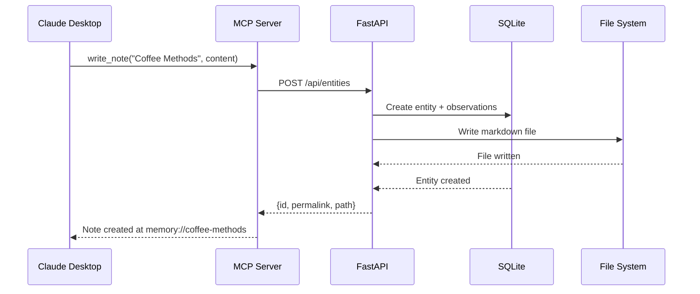

Basic Memory implements the [Model Context Protocol (MCP)](https://modelcontextprotocol.io/) to enable AI assistants like Claude to read, write, and navigate your knowledge graph. This page explains how the integration works.

## What is MCP?

The Model Context Protocol is an open standard for connecting AI assistants to external data sources and tools. Instead of each AI platform using custom integrations, MCP provides:

- **Standard protocol**: JSON-RPC 2.0 over stdio, HTTP, or SSE
- **Tool definitions**: Structured interface for AI-callable functions
- **Resource access**: Read-only data sources the AI can browse
- **Prompts**: Pre-configured workflows the AI can invoke

Basic Memory runs as an MCP server that exposes your knowledge graph through these interfaces.

## Architecture

The MCP server acts as a bridge between AI assistants and your local knowledge:



### Component Flow

<Steps>
  <Step title="MCP Server">
    Runs locally, started by Claude Desktop. Handles protocol communication and exposes tools, resources, and prompts.
  </Step>
  <Step title="Typed Clients">
    MCP tools use typed clients (in `mcp/clients/`) to communicate with the API:
    - `KnowledgeClient` - Entity CRUD
    - `SearchClient` - Search operations
    - `MemoryClient` - Context building
    - `DirectoryClient` - Directory listing
    - `ResourceClient` - Resource reading
    - `ProjectClient` - Project management
  </Step>
  <Step title="HTTP API">
    FastAPI endpoints handle business logic, using services and repositories to interact with the database and file system.
  </Step>
  <Step title="Database + Files">
    Changes are persisted to both SQLite (for indexing/search) and the file system (source of truth).
  </Step>
</Steps>

### Client Routing

MCP tools use `get_project_client()` for automatic routing based on project mode:

```python
from basic_memory.mcp.project_context import get_project_client

@mcp.tool()
async def my_tool(project: str | None = None, context: Context | None = None):
    async with get_project_client(project, context) as (client, active_project):
        # client is routed based on project's mode:
        # - LOCAL: Direct ASGI client (in-process)
        # - CLOUD: HTTP client with API key auth
        response = await call_get(client, "/entities/123")
        return response
```

This enables per-project cloud routing - some projects can use local storage while others route through the cloud.

## MCP Tools

Tools are functions the AI can call to manipulate your knowledge graph.

### Content Management

<AccordionGroup>
  <Accordion title="write_note()">
    Create or update markdown notes:

    ```python
    write_note(
        title="Coffee Brewing Methods",
        content="# Coffee Brewing Methods\n\nPour over vs French press...",
        directory="coffee",
        tags=["coffee", "brewing"]
    )
    ```

    **What it does:**
    1. Creates entity in database
    2. Writes markdown file with frontmatter
    3. Parses observations and relations
    4. Returns `memory://` URL for the note

    **Source:** `mcp/tools/write_note.py`
  </Accordion>
  <Accordion title="read_note()">
    Read notes by title, permalink, or memory:// URL:

    ```python
    # By title
    read_note("Coffee Brewing Methods")

    # By permalink
    read_note(identifier="coffee-brewing-methods")

    # By memory:// URL
    read_note(identifier="memory://coffee-brewing-methods")
    ```

    **Returns:** Formatted note with frontmatter, content, observations, relations, and outgoing/incoming links.

    **Source:** `mcp/tools/read_note.py`
  </Accordion>
  <Accordion title="edit_note()">
    Edit notes incrementally without full rewrite:

    ```python
    # Append content
    edit_note("project-plan", operation="append", content="\n## Next Steps\n- Finalize rollout")

    # Find and replace
    edit_note("docs/api", operation="find_replace", find_text="v0.14.0", content="v0.15.0")

    # Replace section
    edit_note("docs/setup", operation="replace_section", section="## Installation", content="...")
    ```

    **Operations:** `append`, `prepend`, `find_replace`, `replace_section`

    **Source:** `mcp/tools/edit_note.py`
  </Accordion>
  <Accordion title="move_note()">
    Move notes or directories:

    ```python
    move_note(
        identifier="coffee-brewing",
        destination_path="recipes/coffee/brewing.md"
    )
    ```

    Updates database and maintains wiki link integrity.

    **Source:** `mcp/tools/move_note.py`
  </Accordion>
  <Accordion title="delete_note()">
    Delete notes or directories:

    ```python
    delete_note(identifier="old-note")
    delete_note(identifier="old-directory", is_directory=True)
    ```

    Removes from both database and file system.

    **Source:** `mcp/tools/delete_note.py`
  </Accordion>
</AccordionGroup>

### Knowledge Graph Navigation

<AccordionGroup>
  <Accordion title="build_context()">
    Navigate the knowledge graph via memory:// URLs:

    ```python
    build_context(
        url="memory://coffee-brewing-methods",
        depth=2,  # Follow relations 2 levels deep
        timeframe="1 week"  # Only recent content
    )
    ```

    **Returns:** JSON structure with entity + related entities following graph edges.

    **Use case:** Load conversation context from previous sessions.

    **Source:** `mcp/tools/build_context.py`
  </Accordion>
  <Accordion title="recent_activity()">
    Get recently updated information:

    ```python
    recent_activity(
        type="entities",  # or "observations", "both"
        timeframe="3 days",
        depth=1
    )
    ```

    **Returns:** Recently modified entities with optional related content.

    **Source:** `mcp/tools/recent_activity.py`
  </Accordion>
  <Accordion title="list_directory()">
    Browse directory contents:

    ```python
    list_directory(
        dir_name="coffee",
        depth=2,  # Recursive depth
        file_name_glob="*.md"  # Filter pattern
    )
    ```

    **Returns:** Directory tree with files and subdirectories.

    **Source:** `mcp/tools/list_directory.py`
  </Accordion>
</AccordionGroup>

### Search & Discovery

<AccordionGroup>
  <Accordion title="search_notes()">
    Full-text search with advanced filtering:

    ```python
    search_notes(
        query="coffee brewing",
        search_type="full",  # or "prefix"
        entity_types=["note"],
        tags=["brewing"],
        after_date="2024-01-01",
        metadata_filters={"status": "active"}
    )
    ```

    **Search types:**
    - `full` - Match anywhere in content (default)
    - `prefix` - Match at word boundaries

    **Source:** `mcp/tools/search.py`
  </Accordion>
</AccordionGroup>

### Project Management

<AccordionGroup>
  <Accordion title="list_memory_projects()">
    List all configured projects:

    ```python
    list_memory_projects()
    ```

    **Returns:** Projects with their paths, modes (LOCAL/CLOUD), and status.

    **Source:** `mcp/tools/project_management.py`
  </Accordion>
  <Accordion title="create_memory_project()">
    Create new Basic Memory project:

    ```python
    create_memory_project(
        project_name="research",
        project_path="~/Documents/research",
        set_default=True
    )
    ```

    **Source:** `mcp/tools/project_management.py`
  </Accordion>
</AccordionGroup>

## MCP Resources

Resources are read-only data sources the AI can browse:

### memory://

List all entities:

```
memory://entities
```

Returns JSON list of all entities with metadata.

### Project Info

Current project statistics:

```
memory://project-info
```

Returns entity count, observation count, relation count, project path.

**Source:** `mcp/resources/project_info.py`

## MCP Prompts

Prompts are pre-configured workflows the AI can invoke:

<AccordionGroup>
  <Accordion title="continue_conversation">
    Resume a previous conversation with context:

    ```python
    # Prompt: "Continue our conversation about search"
    # Invokes: continue_conversation(topic="search", timeframe="1 week")
    ```

    **What it does:**
    1. Searches for entities matching the topic
    2. Loads recent changes (timeframe)
    3. Builds rich context using `build_context()`
    4. Returns formatted markdown for the AI

    **Source:** `mcp/prompts/continue_conversation.py`
  </Accordion>
  <Accordion title="search">
    Search with formatted, detailed results:

    ```python
    # Prompt: "Search for coffee brewing methods"
    # Invokes: search(query="coffee brewing", after_date=None)
    ```

    Returns search results with entity metadata, observation excerpts, and relation context.

    **Source:** `mcp/prompts/search.py`
  </Accordion>
  <Accordion title="recent_activity">
    View recent changes with formatted output:

    ```python
    # Prompt: "What changed recently?"
    # Invokes: recent_activity(timeframe="3 days")
    ```

    **Source:** `mcp/prompts/recent_activity.py`
  </Accordion>
</AccordionGroup>

## Configuration

### Claude Desktop

Add to `~/Library/Application Support/Claude/claude_desktop_config.json` (macOS):

```json
{
  "mcpServers": {
    "basic-memory": {
      "command": "uvx",
      "args": ["basic-memory", "mcp"]
    }
  }
}
```

With specific project:

```json
{
  "mcpServers": {
    "basic-memory": {
      "command": "uvx",
      "args": ["basic-memory", "mcp", "--project", "research"]
    }
  }
}
```

### VS Code

Add to `.vscode/mcp.json` in your workspace:

```json
{
  "servers": {
    "basic-memory": {
      "command": "uvx",
      "args": ["basic-memory", "mcp"]
    }
  }
}
```

Or global settings: `Preferences: Open User Settings (JSON)` → `"mcp": { "servers": {...} }`

## Transport Modes

MCP supports multiple transport layers:

### stdio (default)

JSON-RPC over standard input/output:

```bash
basic-memory mcp --transport stdio
```

Used by Claude Desktop and most MCP clients.

### SSE (Server-Sent Events)

HTTP-based streaming for web clients:

```bash
basic-memory mcp --transport sse --port 8000
```

Always uses local routing (no cloud).

### Streamable HTTP

HTTP with streaming responses:

```bash
basic-memory mcp --transport streamable-http --port 8000
```

Always uses local routing (no cloud).

## Cloud Routing

Individual projects can route through the cloud while others stay local:

```bash
# Save API key
basic-memory cloud set-key bmc_abc123...

# Set project to cloud mode
basic-memory project set-cloud research

# MCP tools automatically route based on project mode
# stdio transport: honors per-project routing
# sse/streamable-http: always local
```

See [Cloud Sync](/guides/cloud-sync) for details.

## Error Handling

MCP tools return structured errors:

```json
{
  "error": {
    "code": -32603,
    "message": "Entity not found",
    "data": {
      "identifier": "nonexistent-note"
    }
  }
}
```

Common error codes:
- `-32600` - Invalid request
- `-32601` - Method not found
- `-32602` - Invalid parameters
- `-32603` - Internal error

## Performance

- **Tool calls**: Sub-second for most operations
- **Search**: Sub-millisecond (FTS5 indexed)
- **Context building**: Scales linearly with depth × relations
- **File writes**: Atomic with checksum validation

See [How It Works](/concepts/how-it-works) for architecture details.

## Security

- **Local by default**: MCP server runs locally, no network access required
- **Cloud mode**: Optional, uses JWT tokens or API keys
- **File system**: Access limited to project directories
- **Validation**: All inputs validated via Pydantic schemas

## Debugging

Enable debug logging:

```bash
BASIC_MEMORY_LOG_LEVEL=DEBUG basic-memory mcp

# View logs
tail -f ~/.basic-memory/basic-memory.log
```

Test MCP server:

```bash
# Run MCP Inspector
just run-inspector

# Or with npx
npx @modelcontextprotocol/inspector uvx basic-memory mcp
```

## Best Practices

<CardGroup cols={2}>
  <Card title="Use Specific Tools" icon="wrench">
    Call specific tools (`write_note`, `edit_note`) rather than asking the AI to "update my notes" - this ensures correct tool usage.
  </Card>
  <Card title="Leverage Context Building" icon="sitemap">
    Use `build_context()` to load rich context from previous conversations rather than re-reading multiple notes individually.
  </Card>
  <Card title="Structure with Observations" icon="list">
    Use observations for structured data within notes - they're indexed and searchable separately from content.
  </Card>
  <Card title="Set Depth Limits" icon="layer-group">
    When traversing the graph, use appropriate depth limits (1-3) to avoid exponential expansion.
  </Card>
</CardGroup>

## Next Steps

<CardGroup cols={2}>
  <Card title="MCP Tools Reference" icon="tools" href="/api/mcp/overview">
    Complete reference for all MCP tools
  </Card>
  <Card title="Knowledge Graph" icon="diagram-project" href="/concepts/knowledge-graph">
    Understand entities, observations, and relations
  </Card>
</CardGroup>